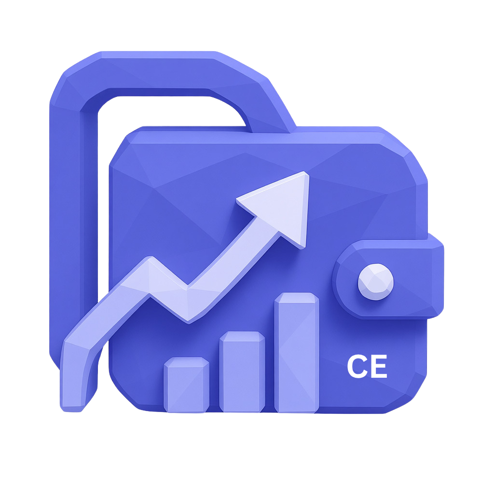
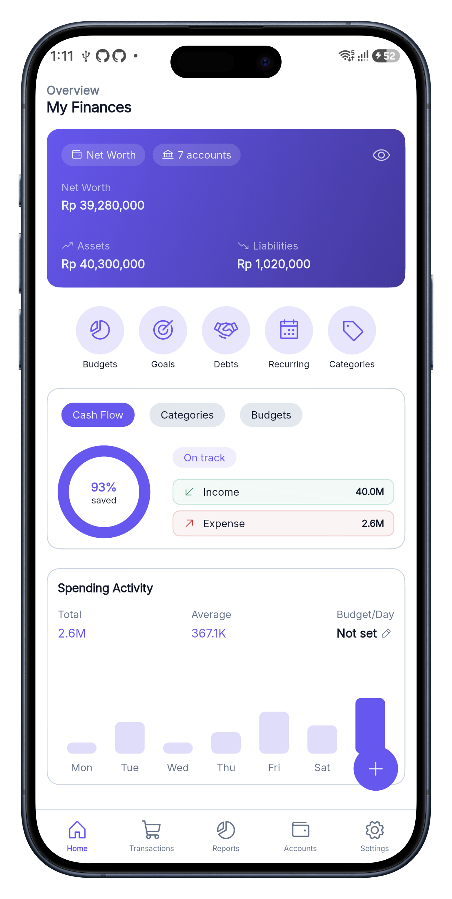
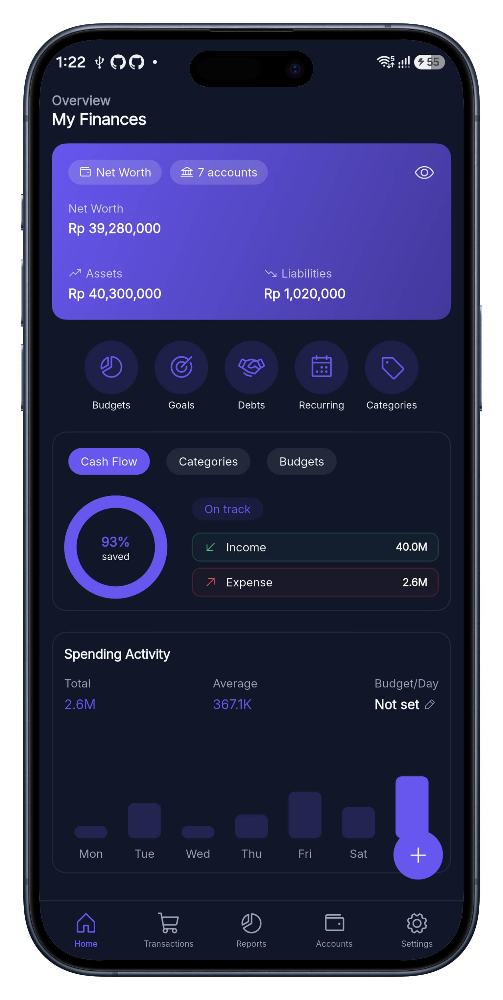
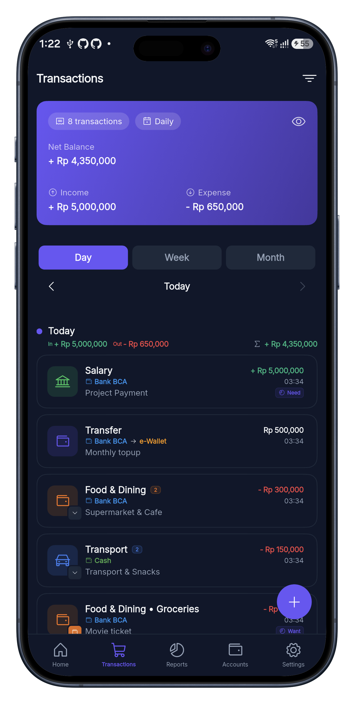
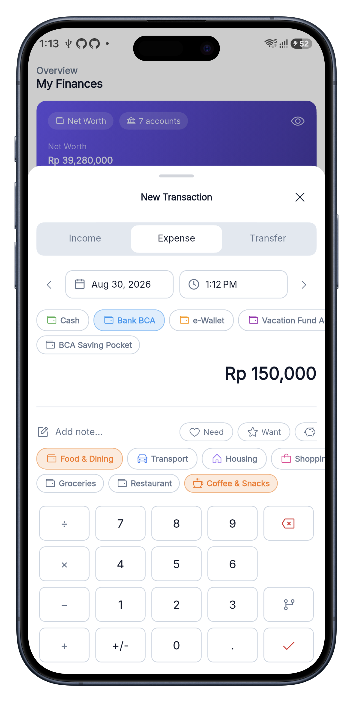
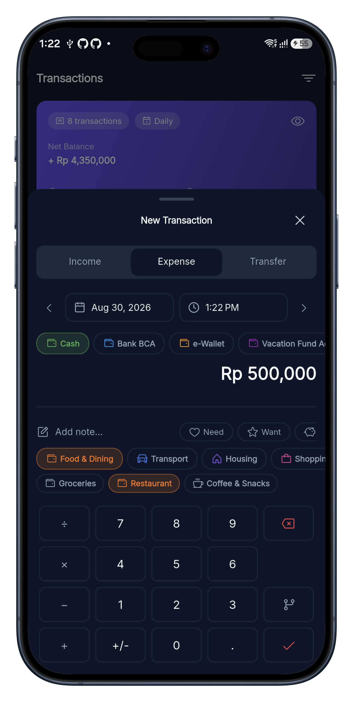
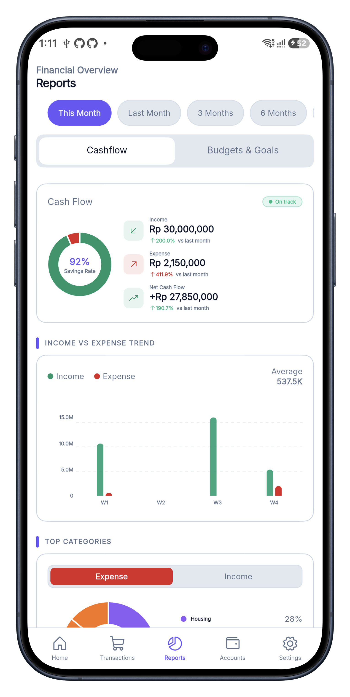
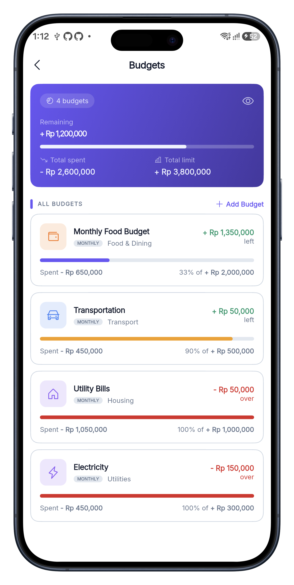

<p align="center">
  
</p>


<p align="center">
  <a href="https://github.com/getpoka/poka-ce/actions/workflows/ci.yml">
    
  </a>
  <a href="https://github.com/getpoka/poka-ce/releases">
    
  </a>
  <a href="https://github.com/getpoka/poka-ce/blob/main/LICENSE">
    
  </a>
</p>

# Poka CE (Community Edition)

Poka CE is a personal finance management application built with Flutter. It provides a simple, flat-design interface to help you manage your accounts, budgets, goals, debts, categories, and transactions efficiently and offline-first using a local SQLite database (via Drift).

<p align="center">
   &nbsp; &nbsp;
  
</p>

<details>
  <summary><b>🖼️ Tap to view more screenshots</b></summary>
  <br/>

  | Home | Home (Dark) | Transactions | Transactions (Dark) |
  | :---: | :---: | :---: | :---: |
  |  |  |  |  |
  | **Expense Form** | **Expense (Dark)** | **Reports** | **Budgets** |
  |  |  |  |  |
</details>


## ✨ Features

- 📱 **Offline First**: All data is stored locally on your device for complete privacy and speed.
- 💳 **Accounts**: Manage multiple accounts with different balances.
- 💸 **Transactions**: Record income, expenses, and transfers between accounts.
- 📊 **Budgets**: Set up monthly budgets to control your spending.
- 🎯 **Goals**: Create saving goals and track your progress.
- 🤝 **Debts**: Keep track of your loans and debts.
- 🏷️ **Categories**: Organize your transactions with customizable categories and icons.
- 🎨 **Beautiful UI**: Flat design built with [ForUI](https://github.com/forui-dev/forui), without shadows, keeping the interface clean and modern.

---

## 🛠 Tech Stack

- **Framework**: [Flutter](https://flutter.dev/) & Dart
- **State Management**: [Riverpod](https://riverpod.dev/) (`riverpod_generator`)
- **Database**: [Drift](https://drift.simonbinder.eu/) (SQLite)
- **UI & Design**: [ForUI](https://github.com/forui-dev/forui) (Flat design constraints)
- **Routing**: [GoRouter](https://pub.dev/packages/go_router)
- **Localization**: [Slang](https://pub.dev/packages/slang)

---

## 🚀 Download & Install

You can download the latest version of Poka CE directly from our [GitHub Releases page](https://github.com/getpoka/poka-ce/releases).

**System Requirements:**
- **OS**: Android 5.0 (Lollipop) or newer (API level 21+)
- **Storage**: ~30 MB free space (if using Split APK)
- **Internet**: Not required! Poka CE is 100% offline.

**Which APK should I choose?**
To save your data quota and storage, we provide optimized, smaller APKs for different devices.
- `app-arm64-v8a-release.apk` 🚀 **(Recommended)**: Choose this for almost all modern Android phones (2016 and newer).
- `app-armeabi-v7a-release.apk`: Choose this if you are using an older 32-bit Android phone.
- `app-universal-release.apk`: Choose this if you are unsure or if the others fail to install. It works on all devices but is larger in size.

---

## 💻 Getting Started (For Developers)

### Prerequisites

- Flutter SDK (version 3.47.1 or newer recommended)
- Dart SDK (version 3.13.1 or newer recommended)
- Make (optional, but recommended for build scripts)

### Installation

1. **Clone the repository:**
   ```bash
   git clone https://github.com/getpoka/poka_ce.git
   cd poka_ce
   ```

2. **Install dependencies:**
   ```bash
   flutter pub get
   ```

3. **Set up the environment variables:**
   Copy the example environment file:
   ```bash
   cp .env.example .env
   ```
   *Note: `.env` is required. You can control the database seeder by setting `POKA_SEED_ESSENTIALS=true` (for basic categories) and `POKA_SEED_DUMMY_DATA=true` (for testing data) in your `.env` file.*

4. **Generate code (Freezed, Riverpod, Drift, Slang, GoRouter):**
   ```bash
   make generate
   ```
   *(Or run `dart run build_runner build -d` if you don't use Make)*

5. **Run the application:**
   ```bash
   flutter run --dart-define-from-file=.env
   ```

---

## 🌍 Translations

Poka CE uses [slang](https://pub.dev/packages/slang) for i18n with namespaces. We would love your help to translate Poka CE into your local language! 
Simply duplicate the base `lib/i18n/en/` folder, rename the duplicated folder to your language code (e.g., `es/` for Spanish), translate the values inside the JSON files, and submit a Pull Request.

---

## 🛠️ Development Commands

- **Build APK:**
  ```bash
  flutter build apk --dart-define-from-file=.env
  ```
- **Check (Linting & Formatting):**
  ```bash
  make check
  ```
- **Fix Lints:**
  ```bash
  make fix
  ```
- **Run Tests:**
  ```bash
  flutter test
  ```
- **Test Coverage:**
  ```bash
  flutter test --coverage
  ```

---

## 🤝 Contributing

Please read [CONTRIBUTING.md](CONTRIBUTING.md) for details on our code of conduct, architecture constraints, and the process for submitting pull requests to us.

---

## 📄 License

This project is licensed under the Apache License 2.0 - see the [LICENSE](LICENSE) file for details.
